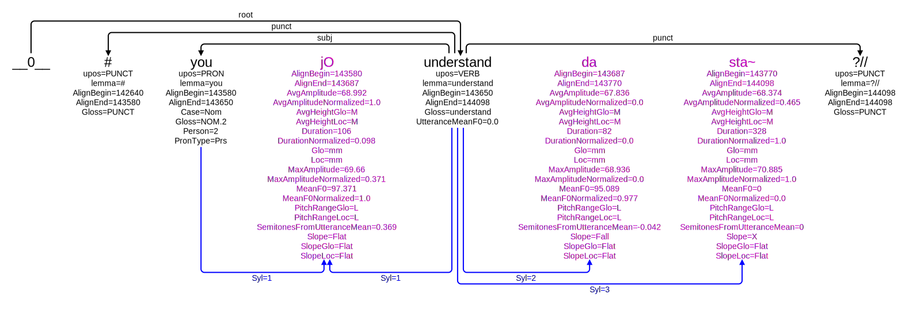

# SUD_Naija-NSC-prosody

This folder contains the code for the production of the corpus **SUD_Naija-NSC-prosody** in which each syllable is represented by a specific node.

The produced treebank is available in [Grew-match](https://naija.grew.fr/?corpus=SUD_Naija-NSC-prosody).

The production is done in two steps:
 - the Python script `make_syllabes.py` introduced new nodes in the CoNLL-U file (using the enhanced UD notion of empty nodes)
 - the Grew GRS `fused.grs` modify the graph structure for the final representation of fused syllable

## Example

For the sentence `ENU_22_Barman-Interview_MG__53` *# you _ understand _ ?//*, we show below the 3 representations:

### Encoding in `SUD_Naija-NSC``

### After the application of the Python script `make_syllabes.py`

### Final representation after grew Grew transformation (GRS `fused.grs`)

